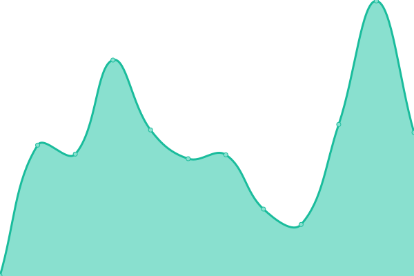

# [📈 실시간 상태](https://DOCHIS.github.io/status): <!--live status--> **모든 시스템 정상 작동 중**

This repository contains the open-source uptime monitor and status page for [Dochis](http://dochis.net), powered by [Upptime](https://github.com/upptime/upptime).

With [Upptime](https://upptime.js.org), you can get your own unlimited and free uptime monitor and status page, powered entirely by a GitHub repository. We use [Issues](https://github.com/DOCHIS/status/issues) as incident reports, [Actions](https://github.com/DOCHIS/status/actions) as uptime monitors, and [Pages](https://DOCHIS.github.io/status) for the status page.

## [📈 Live Status](https://demo.upptime.js.org): <!--live status--> **모든 시스템 정상 작동 중**

<!--start: status pages-->
<!-- This summary is generated by Upptime (https://github.com/upptime/upptime) -->
<!-- Do not edit this manually, your changes will be overwritten -->
<!-- prettier-ignore -->
| URL | Status | History | Response Time | Uptime |
| --- | ------ | ------- | ------------- | ------ |
|  [afreeca.dochis.net(Main)](http://afreeca.dochis.net) | 정상 | [afreeca-dochis-net-main.yml](https://github.com/DOCHIS/status/commits/HEAD/history/afreeca-dochis-net-main.yml) | 

 1031ms
     
 | 

<a href="https://DOCHIS.github.io/status/history/afreeca-dochis-net-main">100.00%</a>
    

|  [afreeca.dochis.net(API)](http://afreeca.dochis.net/api/status/database) | 정상 | [afreeca-dochis-net-api.yml](https://github.com/DOCHIS/status/commits/HEAD/history/afreeca-dochis-net-api.yml) | 

 163ms
     
 | 

<a href="https://DOCHIS.github.io/status/history/afreeca-dochis-net-api">100.00%</a>
    

|  [afreeca.dochis.net(Socket)](http://afreeca.dochis.net/api/status/socket) | 정상 | [afreeca-dochis-net-socket.yml](https://github.com/DOCHIS/status/commits/HEAD/history/afreeca-dochis-net-socket.yml) | 

 165ms
     
 | 

<a href="https://DOCHIS.github.io/status/history/afreeca-dochis-net-socket">100.00%</a>
    

|  [afreehp.kr(Third-Party)](http://afreehp.kr/) | 정상 | [afreehp-kr-third-party.yml](https://github.com/DOCHIS/status/commits/HEAD/history/afreehp-kr-third-party.yml) | 

 1105ms
     
 | 

<a href="https://DOCHIS.github.io/status/history/afreehp-kr-third-party">100.00%</a>
    

|  [doc.ssapi.kr](https://doc.ssapi.kr/) | 정상 | [doc-ssapi-kr.yml](https://github.com/DOCHIS/status/commits/HEAD/history/doc-ssapi-kr.yml) | 

 287ms
     
 | 

<a href="https://DOCHIS.github.io/status/history/doc-ssapi-kr">100.00%</a>
    

|  [api.ssapi.kr](http://api.ssapi.kr/status/database) | 정상 | [api-ssapi-kr.yml](https://github.com/DOCHIS/status/commits/HEAD/history/api-ssapi-kr.yml) | 

 610ms
     
 | 

<a href="https://DOCHIS.github.io/status/history/api-ssapi-kr">100.00%</a>
    

|  [socket.ssapi.kr](http://api.ssapi.kr/status/socket) | 정상 | [socket-ssapi-kr.yml](https://github.com/DOCHIS/status/commits/HEAD/history/socket-ssapi-kr.yml) | 

 1193ms
     
 | 

<a href="https://DOCHIS.github.io/status/history/socket-ssapi-kr">100.00%</a>
    

|  [afreeca-emotes.vercel.app(Main)](https://afreeca-emotes.vercel.app/) | 정상 | [afreeca-emotes-vercel-app-main.yml](https://github.com/DOCHIS/status/commits/HEAD/history/afreeca-emotes-vercel-app-main.yml) | 

 283ms
     
 | 

<a href="https://DOCHIS.github.io/status/history/afreeca-emotes-vercel-app-main">100.00%</a>
    

|  [afreeca-emotes.vercel.app(API)](https://afreeca-emotes.vercel.app/api/v1/fun-facts) | 정상 | [afreeca-emotes-vercel-app-api.yml](https://github.com/DOCHIS/status/commits/HEAD/history/afreeca-emotes-vercel-app-api.yml) | 

 302ms
     
 | 

<a href="https://DOCHIS.github.io/status/history/afreeca-emotes-vercel-app-api">100.00%</a>
    

|  [dochis.github.io/hananacard](https://dochis.github.io/hananacard) | 정상 | [dochis-github-io-hananacard.yml](https://github.com/DOCHIS/status/commits/HEAD/history/dochis-github-io-hananacard.yml) | 

 109ms
     
 | 

<a href="https://DOCHIS.github.io/status/history/dochis-github-io-hananacard">100.00%</a>
    

|  [dragon-egg-game.vercel.app](https://dragon-egg-game.vercel.app) | 정상 | [dragon-egg-game-vercel-app.yml](https://github.com/DOCHIS/status/commits/HEAD/history/dragon-egg-game-vercel-app.yml) | 

 138ms
     
 | 

<a href="https://DOCHIS.github.io/status/history/dragon-egg-game-vercel-app">100.00%</a>
    

<!--end: status pages-->

[**Visit our status website →**](https://DOCHIS.github.io/status)

## 📄 License

- Powered by: [Upptime](https://github.com/upptime/upptime)
- Code: [MIT](./LICENSE) © [Anand Chowdhary](https://anandchowdhary.com), supported by [Pabio](https://pabio.com)
- Data in the `./history` directory: [Open Database License](https://opendatacommons.org/licenses/odbl/1-0/)
