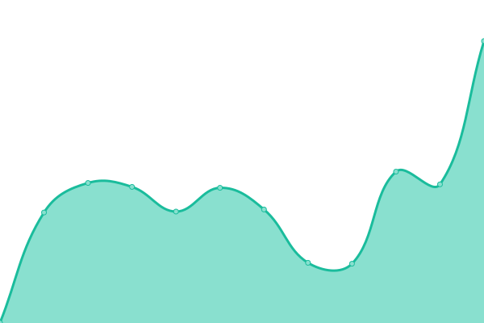
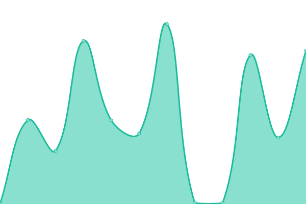
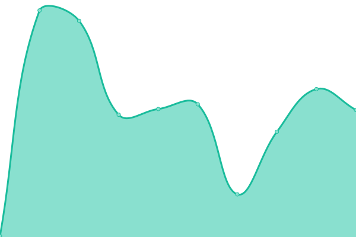

# [📈 실시간 상태](https://DOCHIS.github.io/status): <!--live status--> **모든 시스템 정상 작동 중**

This repository contains the open-source uptime monitor and status page for [Dochis](http://dochis.net), powered by [Upptime](https://github.com/upptime/upptime).

With [Upptime](https://upptime.js.org), you can get your own unlimited and free uptime monitor and status page, powered entirely by a GitHub repository. We use [Issues](https://github.com/DOCHIS/status/issues) as incident reports, [Actions](https://github.com/DOCHIS/status/actions) as uptime monitors, and [Pages](https://DOCHIS.github.io/status) for the status page.

## [📈 Live Status](https://demo.upptime.js.org): <!--live status--> **모든 시스템 정상 작동 중**

<!--start: status pages-->
<!-- This summary is generated by Upptime (https://github.com/upptime/upptime) -->
<!-- Do not edit this manually, your changes will be overwritten -->
<!-- prettier-ignore -->
| URL | Status | History | Response Time | Uptime |
| --- | ------ | ------- | ------------- | ------ |
|  [ssapi.kr](https://ssapi.kr/) | 정상 | [ssapi-kr.yml](https://github.com/DOCHIS/status/commits/HEAD/history/ssapi-kr.yml) | 

 729ms
     
 | 

<a href="https://DOCHIS.github.io/status/history/ssapi-kr">100.00%</a>
    

|  [api.ssapi.kr](http://api.ssapi.kr/status/database) | 정상 | [api-ssapi-kr.yml](https://github.com/DOCHIS/status/commits/HEAD/history/api-ssapi-kr.yml) | 

 776ms
     
 | 

<a href="https://DOCHIS.github.io/status/history/api-ssapi-kr">100.00%</a>
    

|  [socket.ssapi.kr](http://api.ssapi.kr/status/socket) | 정상 | [socket-ssapi-kr.yml](https://github.com/DOCHIS/status/commits/HEAD/history/socket-ssapi-kr.yml) | 

 1711ms
     
 | 

<a href="https://DOCHIS.github.io/status/history/socket-ssapi-kr">99.64%</a>
    

|  [dochis.github.io/hananacard](https://dochis.github.io/hananacard) | 정상 | [dochis-github-io-hananacard.yml](https://github.com/DOCHIS/status/commits/HEAD/history/dochis-github-io-hananacard.yml) | 

 139ms
     
 | 

<a href="https://DOCHIS.github.io/status/history/dochis-github-io-hananacard">100.00%</a>
    

|  [dragon-egg-game.vercel.app](https://dragon-egg-game.vercel.app) | 정상 | [dragon-egg-game-vercel-app.yml](https://github.com/DOCHIS/status/commits/HEAD/history/dragon-egg-game-vercel-app.yml) | 

 157ms
     
 | 

<a href="https://DOCHIS.github.io/status/history/dragon-egg-game-vercel-app">99.57%</a>
    

<!--end: status pages-->

[**Visit our status website →**](https://DOCHIS.github.io/status)

## 📄 License

- Powered by: [Upptime](https://github.com/upptime/upptime)
- Code: [MIT](./LICENSE) © [Anand Chowdhary](https://anandchowdhary.com), supported by [Pabio](https://pabio.com)
- Data in the `./history` directory: [Open Database License](https://opendatacommons.org/licenses/odbl/1-0/)
